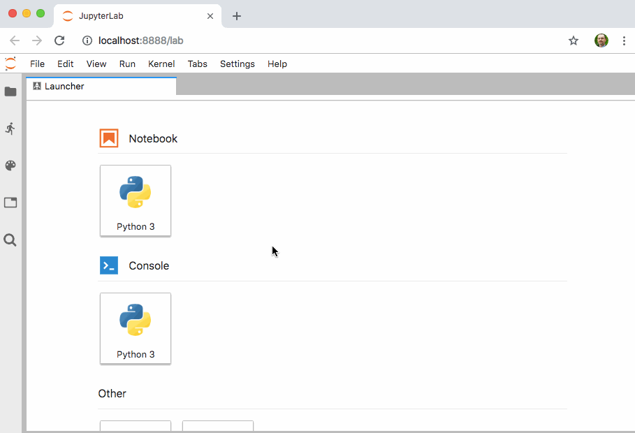

# jupyterlab-quickopen

[](https://mybinder.org/v2/gh/parente/jupyterlab-quickopen/master?urlpath=lab%2Ftree%2Fbinder%2Ftutorial.ipynb)

Quickly open a file in JupyterLab by typing part of its name



## Compatibility

* JupyterLab 0.35.x
* Jupyter Notebook >=5.2.x
* Notebook server configurations where notebook documents and other files reside
  on the local filesystem (which is the the notebook server default)

## Install

Install the Jupyter Notebook server extension under `PREFIX` (e.g., the active
virtualenv or conda env).

```
pip install jupyterlab-quickopen
```

Then install the JupyterLab frontend extension.

```
jupyter labextension install @parente/jupyterlab-quickopen
```

### Install Alternatives

You can use `jupyter serverextension` commands to enable and disable the
server extension in different contexts, e.g.:

```
jupyter serverextension enable --py jupyterlab_quickopen --user
jupyter serverextension disable --py jupyterlab_quickopen --sys-prefix
```

## Configure

### A Keyboard Shortcut

You can assign a keyboard shortcut to show the quickopen panel at any time. Open
the keyboard editor by clicking *Settings &rarr; Advanced Settings Editor
&rarr; Keyboard Shortcuts*. Then enter JSON in the *User Overrides* text area
like the following, adjusting the `keys` value to assign the shortcut of your
choosing:

```
{
    "quickopen:activate": {
      "command": "quickopen:activate",
      "keys": [
        "Accel Ctrl P"
      ],
      "selector": "body",
      "title": "Activate Quick Open",
      "category": "Main Area"
    }
}
```

### Patterns to Exclude

You can control which files to exclude from the quick open list using
Notebook server settings, JupyterLab settings, or both.

On the server side, use the `ContentsManager.allow_hidden`
and/or `ContentsManager.hide_globs` settings. See the
[documentation about Jupyter Notebook options](https://jupyter-notebook.readthedocs.io/en/stable/config.html)
for details.

In the JupyterLab web app, open the *Settings* menu, click the *Advanced
Settings Editor* option, select the *Quick Open* item in the *Raw View* sidebar,
and enter JSON in the *User Overrides* text area to override the default
values.


## Develop

The project includes a Makefile which makes setting up a development environment
using `conda` easy.

```
# Create a conda environment and install the lab/server extensions
make conda-env

# In one terminal, watch the frontend extension source for changes and rebuild
# the extension package
make watch-src

# In a second terminal, watch for rebuilt extension packages and rebuild
# jupyterlab to include them
make watch-lab
```

Keep an eye on the terminal running `watch-src` for TypeScript build errors.
Keep an eye on the terminal running `watch-lab` to know when to refresh your
browser. Quit and re-run the `make watch-lab` command any time you make
changes to the **server** extension.